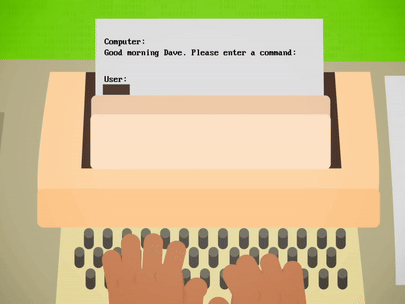
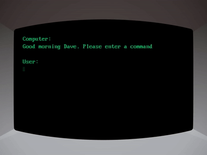
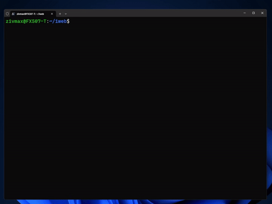
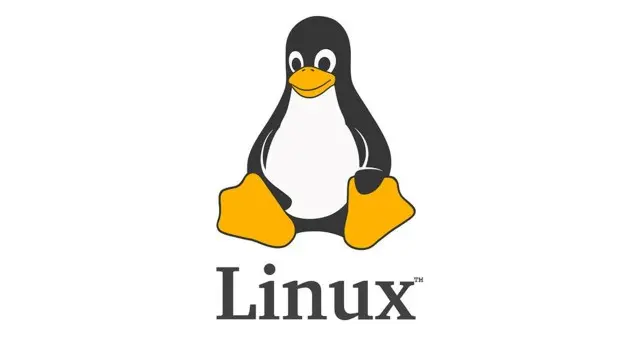

# Lecture 0
{:.no_toc}

* 
{:toc}


## Welcome!

* **Prerequisites**: A basic understanding of programming in any language is required for this course.
* **Course Focus**: This course will teach you how to leverage modern web technologies to build an iGEM wiki site.
* **Additional Benefits**: The skills you gain here can also be applied to creating personal blogs, portfolio websites, or other static web-based projects.
* **Broader Understanding**: By the end of this course, you will have a deeper understanding of how the modern internet works and how to navigate its technologies effectively.

## Course Structure

This course is divided into 5 steps, each building on the previous one. The steps are as follows:

0. **Command Line Interface, Linux, and Windows Subsystem for Linux**:  
   This step introduces the command line interface (CLI) and the Linux operating system. You will also learn how to set up the Windows Subsystem for Linux (WSL) on your Windows machine, enabling you to work in a Linux environment while still using Windows.

1. **Networks and the Internet**:  
   This step covers the fundamentals of computer networks and the internet. You will learn how data is transmitted over networks, how the internet functions, and how web servers and browsers communicate.

2. **HTML, CSS, and JavaScript**:  
   This step introduces the core technologies of the web: HTML, CSS, and JavaScript. You will learn how to create the structure of a web page using HTML, style it with CSS, and add interactivity using JavaScript.

3. **React and Node.js**:  
   This step introduces React, a popular JavaScript library for building user interfaces, and Node.js, a JavaScript runtime for server-side applications. You will learn how to create a simple React app and run it without browser but on Node.js.

4. **Gatsby**:  
   This step introduces Gatsby, a static site generator that uses React and Node.js to build fast and efficient websites. You will learn how to create a personal blog using Gatsby.

5. **Git and Deployment**:  
   This step introduces Git, a version control system, and demonstrates how to deploy your website using services like GitHub Pages and Netlify. You will learn how to manage your code and publish your site to the web.


## Command Line Interface

### Where CLI Comes From
   * **Text-Based Interaction**: In a certain of period, computers were input with typewriters, so every input will be remain on the paper, then the computer will print the output on the paper too.  
    

   * **Use Screen as Paper**: Even after the usage of screens, this way of interaction continued, the engineers just view the screen as a infinite long paper. As the screens is where the initial point of the input and the final point of the output, we call such device as a terminal.  
    

   * **Today's CLI**: Nowadays, we often uses Graphical User Interface (GUI) to interact with computers on Windows and MacOS. Under such environment, there's actually no real terminal CLI exists. However, this way of interaction is still widely used, thus many people uses the terminal emulator to interact with the computer.  
    

### Why CLI?

* There are situations that GUI is not available, like on a server without desktop environment. 

* Software with only CLI support is very common. Not only because it makes the development easier, but also provides a interface more ease to interact accurately in programming way.

* If as a professional, you will find that a little more cost on learning CLI will bring you a lot of efficiency.

### Using PowerShell on Windows
* [Windows Terminal](https://apps.microsoft.com/detail/9n0dx20hk701?hl=en-US&gl=US) is a modern terminal emulator on Windows which is recommended for use in this course.

* In the terminal window, some common command-line arguments we may use include: 
    * `cd`, for changing our current directory (folder)
    * `cp`, for copying files and directories
    * `ls`, for listing files in a directory
    * `mkdir`, for making a directory
    * `mv`, for moving (renaming) files and directories
    * `rm`, for removing (deleting) files
    * `rmdir`, for removing (deleting) directories
    * `cat`, for displaying the contents of a file


## PowerShell's Usage Demo 

Lets perform some real operations on the terminal emulator.

1. Let's start by navigating to the Desktop directory using the cd command. The tilde (~) represents our home directory, so this command takes us directly to our Desktop.
```sh
cd ~/Desktop
```

2. Now that we're in the Desktop directory, let's see what files and folders are here using the ls command. This lists all the contents of the current directory.
```sh
ls
```

3. Let's create a new directory called 'test' using the mkdir command. This will make a new folder on our Desktop. After running this command, we can find there is a new folder named 'test' on the Desktop.
```sh
mkdir test
```

4. Now we'll remove the 'test' directory we just created using the rmdir command. This deletes empty directories.
```sh
rmdir test
```

5. Let's create a new text file called hello.txt and write 'Hello, World!' into it. We're using the echo command with the > operator to redirect the output into a file.
```sh
echo "Hello, World!" > hello.txt
```

6. Finally, let's verify the content of our hello.txt file using the cat command. This will display the text we wrote earlier in the terminal.
```sh
cat hello.txt
```

## Operating System

* A operating system (OS) is a software that manages computer hardware and software resources and provides common services for computer programs.

* For example, when your program requests to read a file, the OS will handle whole process instructing the hardware to read the file and then return the content data to your program. 

* Windows is the most popular OS for personal computers, while Linux is the most popular OS for servers.

* Different OS serves for the same purpose as said before, so there's no significant difference when we are using them besides the software ecosystem, especially when we are developing our own softwares.

## Linux


* Specifically, [Linux](https://github.com/torvalds/linux) is a open-source OS under the GNU General Public License (GPL), which means that it is free to use and modify. That's a important reason why Linux is so popular in the server field.

* Many open-source projects are developed on Linux, thus in the context of development, Linux actually has a better support than Windows.    

* The CLI control on Linux is also much more convenient than Windows, since running without GUI is a common situation on Linux.


## Linux's Usage Demo

Let's perform some real operations in a actual Linux machine. The Linux machine used in the lecture is a remote machine, thus the local terminal emulator is the only way to interact with it. Thanks to Powershell supports the many syntax as on Linux, in this demo we just use the exact same commands as in the previous demo.

1. Change current directory to Desktop.
```sh
cd ~/Desktop
```

2. Check the files and folders in the current directory.
```sh
ls
```

3. Create a new directory called 'test'.
```sh
mkdir test
```

4. Check if the 'test' directory is created.
```sh
ls
```

5. Remove the 'test' directory.
```sh
rmdir test
```

6. Check if the 'test' directory is removed.
```sh
ls
```

7. Create a new text file called hello.txt and write 'Hello, World!' into it.
```sh
echo "Hello, World!" > hello.txt
```

8. Verify the content of the hello.txt file.
```sh
cat hello.txt
```

## Windows Subsystem for Linux (WSL)

* Not many people could afford a standalone Linux machine, or replace their Windows machine with a Linux one. However, the [Windows Subsystem for Linux (WSL)](https://learn.microsoft.com/en-us/windows/wsl/) provides a solution for this problem.

* WSL could be view as a high-performance virtual machine that runs a Linux on Windows. In most cases, it just performs as a real GUI-less Linux machine.

* To enable/install it, open PowerShell in administrator mode, enter the `wsl --install` command, then restart your machine.

* Then we could check what Linux distributions are available by entering the `wsl --list --online` command.

* Let's install the latest Ubuntu LTS distribution by entering the `wsl --install -d Ubuntu-24.04` command.


## WSL's Usage Demo

Let's perform some real operations in WSL. WSL has a tight integration with Windows, allowing both systems to access each other's files. However, accessing files across different operating systems can result in significant performance degradation due to technical limitation. Therefore, the best practice is to keep Linux files within the WSL file system to ensure optimal performance. In this demo, we break this principle to demonstrate the integration between WSL and Windows.

1. Change current directory to Windows' Desktop.
```sh
cd /mnt/c/Users/your-username/Desktop
```

2. Check the files and folders in the current directory.
```sh
ls
```

3. Create a new directory called 'test'.
```sh
mkdir test
```

4. Remove the 'test' directory.
```sh
rmdir test
```

5. Create a new text file called hello.txt and write 'Hello, World!' into it.
```sh
echo "Hello, World!" > hello.txt
```

6. Verify the content of the hello.txt file.
```sh
cat hello.txt
```


## Coding Inside WSL

* [VSCode](https://code.visualstudio.com/) is a popular code editor that has a excellent support for WSL. It can provide a seamless experience for coding in WSL.
* First we need to install the [Remote - WSL extension](https://marketplace.visualstudio.com/items?itemName=ms-vscode-remote.remote-wsl) in VSCode.
* Then we can open a WSL terminal in VSCode by clicking the green bottom-left corner button.
* We can both open a WSL VSCode window from a Windows VSCode window, or by type in command `code .` in the WSL terminal.