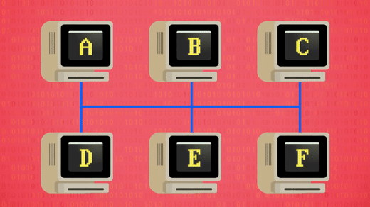
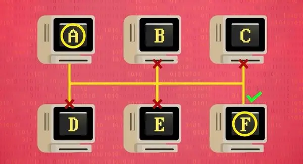
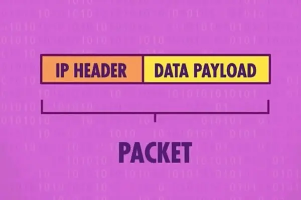
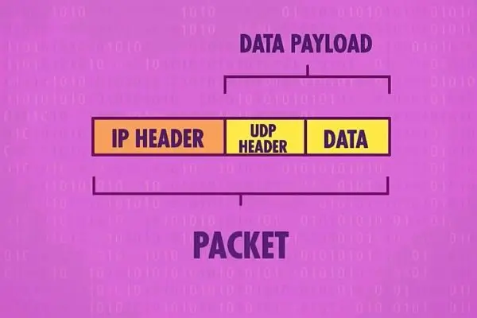
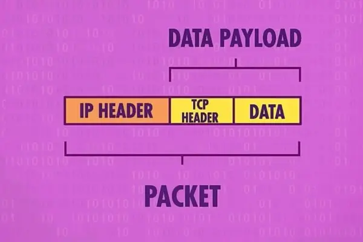

# Lecture 1
{:.no_toc}

* 
{:toc}


## A Naive Network

* Assume we have a network of computers fully connected to each other with bare data cables.
* When a computer sends a message, the signal is broadcasted to all other computers due to physical laws, and all computers receive the message.
* This is a naive network and is not practical.
* 

---

## An Addressed Network

* Assign an address to each computer.
* The sender embeds the address of the receiver in the message.
* When a computer receives a message:
  * It checks the address of the receiver.
  * If the address matches, the computer processes the message.
  * Otherwise, it discards the message.
* 

---

## Internet Protocol (IP)

* Each computer on the Internet has a unique address called an **IP address**.
* When a computer sends a message:
  * It embeds the IP address of the receiver in the message.
* When a computer receives a message:
  * It checks the IP address of the receiver.
  * If the address matches, the computer processes the message.
  * Otherwise, it discards the message.

* The structure of a packet of data under IP:  
    

  In detail **if are interested**:
  ```
  0                   1                   2                   3
  0 1 2 3 4 5 6 7 8 9 0 1 2 3 4 5 6 7 8 9 0 1 2 3 4 5 6 7 8 9 0 1
  +-+-+-+-+-+-+-+-+-+-+-+-+-+-+-+-+-+-+-+-+-+-+-+-+-+-+-+-+-+-+-+-+
  |Version|  IHL  |Type of Service|         Total Length          |
  +-+-+-+-+-+-+-+-+-+-+-+-+-+-+-+-+-+-+-+-+-+-+-+-+-+-+-+-+-+-+-+-+
  |        Identification         |Flags|     Fragment Offset     |
  +-+-+-+-+-+-+-+-+-+-+-+-+-+-+-+-+-+-+-+-+-+-+-+-+-+-+-+-+-+-+-+-+
  | Time to Live  |   Protocol    |        Header Checksum        |
  +-+-+-+-+-+-+-+-+-+-+-+-+-+-+-+-+-+-+-+-+-+-+-+-+-+-+-+-+-+-+-+-+
  |                        Source Address                         |
  +-+-+-+-+-+-+-+-+-+-+-+-+-+-+-+-+-+-+-+-+-+-+-+-+-+-+-+-+-+-+-+-+
  |                      Destination Address                      |
  +-+-+-+-+-+-+-+-+-+-+-+-+-+-+-+-+-+-+-+-+-+-+-+-+-+-+-+-+-+-+-+-+
  |                    Options                    |    Padding    |
  +-+-+-+-+-+-+-+-+-+-+-+-+-+-+-+-+-+-+-+-+-+-+-+-+-+-+-+-+-+-+-+-+
  |                             Data                              |
  +-+-+-+-+-+-+-+-+-+-+-+-+-+-+-+-+-+-+-+-+-+-+-+-+-+-+-+-+-+-+-+-+
  ```

---

## User Datagram Protocol (UDP)

* **UDP** addresses the issue of multiple programs running on a single computer.
* Each program has a unique **port number**.
* When a computer sends a message:
  * It embeds the port number of the receiver in the message.
* When a computer receives a message:
  * It checks the port number of the receiver.
  * If the port number matches, the computer processes the message.
  * Otherwise, it discards the message.


* The structure of a packet of data under UDP:  
  

  In detail **if are interested**:
  ```
  0                   1                   2                   3
  0 1 2 3 4 5 6 7 8 9 0 1 2 3 4 5 6 7 8 9 0 1 2 3 4 5 6 7 8 9 0 1
  +-+-+-+-+-+-+-+-+-+-+-+-+-+-+-+-+-+-+-+-+-+-+-+-+-+-+-+-+-+-+-+-+
  |          Source Port          |       Destination Port        |
  +-+-+-+-+-+-+-+-+-+-+-+-+-+-+-+-+-+-+-+-+-+-+-+-+-+-+-+-+-+-+-+-+
  |            Length             |           Checksum            |
  +-+-+-+-+-+-+-+-+-+-+-+-+-+-+-+-+-+-+-+-+-+-+-+-+-+-+-+-+-+-+-+-+
  |                             Data                              |
  +-+-+-+-+-+-+-+-+-+-+-+-+-+-+-+-+-+-+-+-+-+-+-+-+-+-+-+-+-+-+-+-+
  ```

---

## Transmission Control Protocol (TCP)

* **TCP** improves upon UDP by ensuring:
  * Messages are delivered in order.
  * Messages are delivered without error.
  * Data chunks can arrive in different orders but are reassembled correctly.

* The structure of a packet of data under TCP:  
  
  
  In detail **if are interested**:
  ```
  0                   1                   2                   3
  0 1 2 3 4 5 6 7 8 9 0 1 2 3 4 5 6 7 8 9 0 1 2 3 4 5 6 7 8 9 0 1
  +-+-+-+-+-+-+-+-+-+-+-+-+-+-+-+-+-+-+-+-+-+-+-+-+-+-+-+-+-+-+-+-+
  |          Source Port          |       Destination Port        |
  +-+-+-+-+-+-+-+-+-+-+-+-+-+-+-+-+-+-+-+-+-+-+-+-+-+-+-+-+-+-+-+-+
  |                        Sequence Number                        |
  +-+-+-+-+-+-+-+-+-+-+-+-+-+-+-+-+-+-+-+-+-+-+-+-+-+-+-+-+-+-+-+-+
  |                     Acknowledgment Number                     |
  +-+-+-+-+-+-+-+-+-+-+-+-+-+-+-+-+-+-+-+-+-+-+-+-+-+-+-+-+-+-+-+-+
  |Offset | Res.  |     Flags     |            Window             |
  +-+-+-+-+-+-+-+-+-+-+-+-+-+-+-+-+-+-+-+-+-+-+-+-+-+-+-+-+-+-+-+-+
  |           Checksum            |        Urgent Pointer         |
  +-+-+-+-+-+-+-+-+-+-+-+-+-+-+-+-+-+-+-+-+-+-+-+-+-+-+-+-+-+-+-+-+
  |                    Options                    |    Padding    |
  +-+-+-+-+-+-+-+-+-+-+-+-+-+-+-+-+-+-+-+-+-+-+-+-+-+-+-+-+-+-+-+-+
  |                             Data                              |
  +-+-+-+-+-+-+-+-+-+-+-+-+-+-+-+-+-+-+-+-+-+-+-+-+-+-+-+-+-+-+-+-+
  ```


## The Internet Using TCP/IP

* The **Internet** is a giant network of computers connected to each other.
* The main protocol used is **TCP/IP**, a combination of TCP and IP.
* In theory:
  * We can access any computer on the Internet if we know its **IP address**.
  * We can access a specific program on the computer if we know its **port number**


## Demo on Web Services Hosting

* To demonstrate the how we actually access another computer through the Network using TCP/IP, let's set up a simple web service on a remote machine and access it from our local machine.

* First, let's connect to the machine with the corresponding IP address using SSH to get a terminal on the remote machine. 
  ```bash
  ssh username@ip-address
  ```
> In the lecture demo, the specific command is `ssh zivmax@10.20.229.83`

* Then, let's create a temporary directory and navigate to it.
  ```bash
  mkdir server
  cd server
  ```

* Next, let's create a simple web server using Python.
  ```bash
  python3 -m http.server 8080 --bind 0.0.0.0
  ```
  This command will start a simple http server on port `8080`, and `--bind 0.0.0.0` allows machines with any IP address to access the server.

* Now, let's access the server from our local machine. Open a web browser and type in `http://<ip-address>:8080` in the URL bar.
> In the lecture demo, the specific address is `http://10.20.229.83:8080`.

* We can see the content of the `server` folder on the remote machine is displayed in the web browser on our local machine, but it's empty now.

* Let's add a file to the `server` folder:
  ```bash
  echo "Hello, World!" > hello.txt
  ```
  and refresh the web page on our local machine. We can see the `Hello, World!` is displayed in the web browser.

* In the very early days of the Internet, users just accessed plain text files like this. But as more and more people read on the Internet, some people think it's time to bring some more interesting things to the users.
.

## Inspecting HTTP Logs in CLI
* We can analyze the work of HTTP protocols at terminal. For example, type the following in our terminal window:
  ```
  curl -I http://10.20.229.83:8080
  ```
  Notice that the output of this command returns all the header values of the responses of the server.
    
* Further, execute the following command in our terminal window:
  ```
  curl -I http://10.20.229.83:8080/non-exist
  ```
  Notice that we will see a `404` response, telling us that the requested URL does not exist.
    
* There are numerous other response codes, such as:
  ```
  200 OK
  301 Moved Permanently
  302 Found
  304 Not Modified
  304 Temporary Redirect
  401 Unauthorized
  403 Forbidden
  404 Not Found
  418 I'm a Teapot
  500 Internal Server Error
  503 Service Unavailable
  ```
    
* It’s worth mentioning that `500` errors are always server-side errors, while `400` errors are client-side errors.


## Domain Name System (DNS)

* It would be very tedious if we needed to remember an IP address to visit a website, just like we have to remember a phone number to call someone. This is where DNS comes in.

* DNS, or domain name systems, is a collection of servers on the internet that are used to query the website's IP addresses like `shanghaitech.edu.cn`. Just like the phone book to look up a phone number, DNS is the phone book of the internet.

* So each time when we visit a website, our computer will first ask the DNS server for the IP address of the website, and then use the IP address to visit the website.  
  

* If we use `ping` command in the terminal, we can see the IP address of the website we are visiting:
  ```bash
  ping www.shanghaitech.edu.cn
  ```
  This command will show the actual IP address of the website `www.shanghaitech.edu.cn`.


* For our demo server, we can use a local DNS-like feature to map the IP address to a domain name, which is the local hosts file. Let's add the following line to the `hosts` file on our local machine:
  ```
  ip-address remote-server
  ```
  where `ip-address` is the IP address of the remote machine.
  > In the lecture demo, the specific line is `10.20.229.83 server`.

* Now, we can access the server using the domain name `http://server:8080` in the URL bar of the web browser, instead of the IP address.


## Providing a Web Page

* Let's go back to the remote machine, and add some interesting content to the `server` folder in a new file `file.txt`:  
  ```html
  <!DOCTYPE html>
  
  <html lang="en">
      <head>
          <title>css</title>
      </head>
      <body>
          <p style="font-size: large; text-align: center;">
              Interactive Web Engineering Basics
          </p>
          <p style="font-size: medium; text-align: center;">
              Welcome to home page!
          </p>
          <p style="font-size: small; text-align: center;">
              Copyright &#169; Lin-Zheng Tang
          </p>
      </body>
  </html>
  ```

* Refresh the web page on our local machine, we can see the content of `file.txt` is displayed in the web browser.

* But notice that the content is displayed without the promised "interesting content". To fix this, let's copy the file, but with a different extension name:
  ```bash
  cp file.txt file.html
  ```
  and refresh the web page on our local machine. We can see the content of `file.html` is displayed in the web browser is not plain text anymore.

* What our browser just did, is not only download the file from the remote machine, but also interpret (render) the content of the file, displaying a much more human-readable and fancy content to the user. And this is the start point of the web technologies.

* We'll dive deeper into the web technologies in the next lecture.

