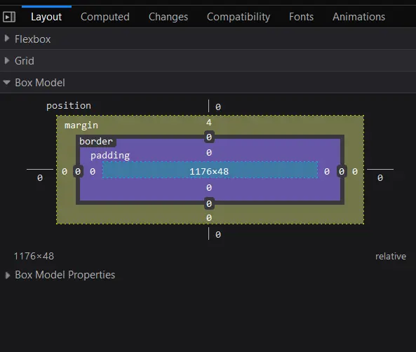
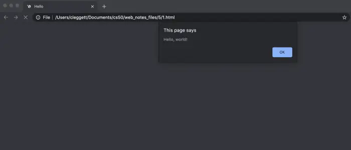
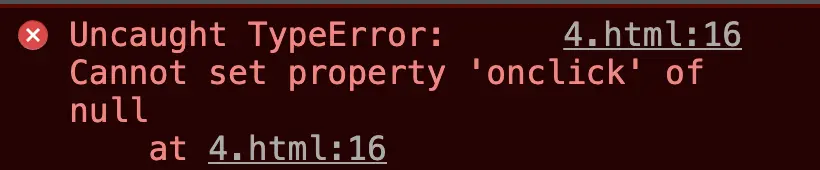
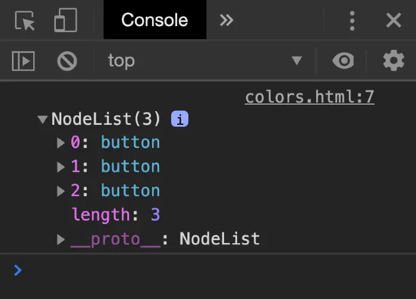

# Lecture 2
{:.no_toc}

* 
{:toc}


## Hypertext Markup Language (HTML)

* HTML is a markup language that defines the structure of a web page. It is interpreted by your web browser (Safari, Google Chrome, Firefox, etc.) in order to display content on your screen.
* Let’s get started by writing a simple HTML file!
  ```html
  <!DOCTYPE html>
  <html lang="en">
      <head>
          <title>Hello!</title>
      </head>
      <body>
          Hello, world!
      </body>
  </html>
  ```

* When we open up this file in our browser, we get:
  <iframe src="src/hello.html"></iframe>


* Now, let’s take some time to talk about the file we just wrote, which seems to be pretty complicated for such a simple page.
  * In the first line, we are declaring (to the web browser) that we are writing the document in the latest version of HTML: HTML5.
  * After that, the page consists of nested **HTML elements** (such as html and body), each with an **opening and closing tag** marked with either `<element>` for an opening and `</element>` for a closing.
  * Notice how each of the inner elements is indented just a bit further than the last. While this is not necessarily required by the browser, it will be very helpful to keep this up in your own code.
  * HTML elements can include **attributes**, which give the browser extra information about the element. For example, when we include `lang="en"` in our initial tag, we are telling the browser that we are using English as our primary language.
  * Inside the HTML element, we typically want to include both a `head` and a `body` tag. The head element will include information about your page that is not necessarily displayed, and the body element will contain what is actually visible to users who visit the site.
  * Within the head, we have included a `title` for our webpage, which you’ll notice is displayed in the tab at the top of our web browser.
  * Finally, we’ve included the text “Hello, world!” in the body, which is the visible part of our page.

### Document Object Model (DOM)


* The DOM is a convenient way of visualizing the way HTML elements relate to each other using a tree-like structure. Above is an example of the DOM layout for the page we just wrote.

  ```mermaid
  graph TD
      A[html] --> B[head]
      A --> C[body]
      B --> D[title]
      D --> E[Hello, world!]
      C --> F[Hello!]

  style E fill:,stroke:#333,stroke-width:2px,color:#7bcc98
  style F fill:,stroke:#333,stroke-width:2px,color:#7bcc98
  ```

### More HTML Elements

* There are many HTML elements you may want to use to customize your page, including headings, lists, and bolded sections. 

* One more thing to note: `<!-- -->` gives us a comment in HTML, so we’ll use that below to explain some of the elements.

* In case you’re worried about it, know that you’ll never have to memorize these elements. It’s very easy to simply search something like “image in HTML” to find the `img` tag. One resource that’s especially helpful for learning about these elements is [W3 Schools](https://www.w3schools.com/html/html_elements.asp).
  ```html
  <!DOCTYPE html>
  <html lang="en">

      <head>
          <title>HTML Elements</title>
      </head>

      <body>
          <!-- We can create headings using h1 through h6 as tags. -->
          <h1>A Large Heading</h1>
          <h2>A Smaller Heading</h2>
          <h6>The Smallest Heading</h6>

          <!-- The strong and i tags give us bold and italics respectively. -->
          A <strong>bold</strong> word and an <i>italicized</i> word!

        <!-- We can link to another page (such as iweb's page) using a. -->
          View the <a href="https://shanghaitech-igem/web">iWEB Website</a>!

          <!-- We used ul for an unordered list and ol for an ordered one. both ordered and unordered lists contain li, or list items. -->
          An unordered list:
          <ul>
              <li>foo</li>
              <li>bar</li>
              <li>baz</li>
          </ul>
          An ordered list:
          <ol>
              <li>foo</li>
              <li>bar</li>
              <li>baz</li>
          </ol>

          <!-- Images require a src attribute, which can be either the path to a file on your computer or the link to an image online. It also includes an alt attribute, which gives a description in case the image can't be loaded. -->
          An image:
          
          <!-- We can also see above that for some elements that don't contain other ones, closing tags are not necessary. -->

          <!-- Here, we use a br tag to add white space to the page. -->
          <br /> <br />

          <!-- A few different tags are necessary to create a table. -->
          <table>
              <thead>
                  <th>Ocean</th>
                  <th>Average Depth</th>
                  <th>Maximum Depth</th>
              </thead>
              <tbody>
                  <tr>
                      <td>Pacific</td>
                      <td>4280 m</td>
                      <td>10911 m</td>
                  </tr>
                  <tr>
                      <td>Atlantic</td>
                      <td>3646 m</td>
                      <td>8486 m</td>
                  </tr>
              </tbody>
          </table>
      </body>

  </html>
  ```

  <iframe src="src/elements.html"></iframe>

## Cascading Style Sheets (CSS)

* CSS is used to customize the appearance of a website.
* While we’re just getting, started, we can add a style attribute to any HTML element in order to apply some CSS to it.
* We change style by altering the CSS properties of an element, writing something like `color: blue` or `text-align: center`
* In this example below, we make a slight change to our very first file to give it a colorful heading:
  ```html
  <!DOCTYPE html>
  <html lang="en">
      <head>
          <title>Hello!</title>
      </head>
      <body>
          <h1 style="color: blue; text-align: center;">A Colorful Heading!</h1>
          Hello, world!
      </body>
  </html>
  ```
  <iframe src="src/blue-heading.html"></iframe>
  

* If we style an outer element, all of the inner elements automatically take on that style. We can see this if we move the styling we just applied from the header tag to the body tag:

  ```html
  <!DOCTYPE html>
  <html lang="en">
      <head>
          <title>Hello!</title>
      </head>
      <body style="color: blue; text-align: center;">
          <h1 >A Colorful Heading!</h1>
          Hello, world!
      </body>
  </html>
  ```

  <iframe src="src/blue-everywhere.html"></iframe>

* While we can style our web page as we’ve done above, to achieve better design, we should be able to move our styling away from the individual lines.
    
  * One way of doing this is to add your styling between `<style>` tags in the `head`. Inside these tags, we write which types of elements we want to be style, and the styling we wish to apply to them. For example:
      ```html
        <html lang="en">
        <!DOCTYPE html>
        <head>
            <title>Hello!</title>
            <style>
                h1 {
                    color: blue;
                    text-align: center;
                }
            </style>
        </head>
        <body>
            <h1 >A Colorful Heading!</h1>
            Hello, world!
        </body>
        </html>
      ```
    
  * Another way is to include in a `<link>` element in your `head` with a link to a styles.css file that contains some styling. This means the HTML file would look like:
      ```html
        <html lang="en">
        <!DOCTYPE html>
        <head>
            <title>Hello!</title>
            <link rel="stylesheet" href="styles.css">
        </head>
        <body>
            <h1 >A Colorful Heading!</h1>
            Hello, world!
        </body>
        </html>
      ```
    
    And our file called `styles.css` would look like:
      ```css
        h1 {
            color: blue;
            text-align: center;
        }
      ```
    
* There are far too many CSS properties to go over here, but just like HTML elements, it’s typically easy to Google something along the lines of “change font to blue CSS” to get the result. Some of the most common ones though are:
  * `color`: the color of text
  * `text-align`: where elements are placed on the page
  * `background-color`: can be set to any color
  * `width`: in pixels or percent of a page
  * `height`: in pixels or percent of a page
  * `padding`: how much space should be left inside an element
  * `margin`: how much space should be left outside an element
  * `font-family`: type of font for text on page
  * `font-size`: in pixels
  * `border`: size type (solid, dashed, etc) color
* Let’s use some of what we just learned to improve upon our oceans table from above. Here’s some HTML to start us off:
  ```html
  <!DOCTYPE html>
  <html lang="en">
      <head>
          <title>Nicer Table</title>
      </head>
      <body>
          <table>
              <thead>
                  <th>Ocean</th>
                  <th>Average Depth</th>
                  <th>Maximum Depth</th>
              </thead>
              <tbody>
                  <tr>
                      <td>Pacific</td>
                      <td>4280 m</td>
                      <td>10911 m</td>
                  </tr>
                  <tr>
                      <td>Atlantic</td>
                      <td>3646 m</td>
                      <td>8486 m</td>
                  </tr>
              </tbody>
          </table>
      </body>
  </html>
  ```

  <iframe src="src/table-bad.html"></iframe>

* The above looks a lot like what we had before, but now, either by including a `style` tag or a `link` to a stylesheet in the head element, we add the following css:
  ```css
  table {
      border: 1px solid black;
      border-collapse: collapse;
  }

  td {
      border: 1px solid black;
      padding: 2px;
  }

  th {
      border: 1px solid black;
      padding: 2px;
  }
  ```
  Which leaves us with this nicer-looking table:  

  <iframe src="src/table-good.html"></iframe>

* You may already be thinking that there’s some needless repetition in our CSS at the moment, as `td` and `th` have the same styling. We can (and should) condense this down to the following code, using a comma to show the styling should apply to more than one element type.
  ```css
  table {
      border: 1px solid black;
      border-collapse: collapse;
  }

  td, th {
      border: 1px solid black;
      padding: 2px;
  }
  ```

* This is a good introduction into what are known as [CSS selectors](https://www.w3schools.com/cssref/css_selectors.asp). There are many ways to determine which HTML elements you are styling, some of which we’ll mention here:
  * **element type**: this is what we’ve been doing so far: styling all elements of the same type.
  * **id**: Another option is to give our HTML elements an id like so: `<h1 id="first-header">Hello!</h1>` and then applying styling using `#first-header{...}` using the hashtag to show that we’re searching by id. Importantly, no two elements can have the same id, and no element can have more than one id.
  * **class**: This is similar to id, but a class can be shared by more than one element, and a single element can have more than one class. We add classes to an HTML element like this: `<h1 class="page-text muted">Hello!</h1>` (note that we just added two classes to the element: `page-text` and `muted`). We then style based on class using a period instead of a hashtag: `.muted {...}`
* Now, we also have to deal with the problem of potentially conflicting CSS. What happens when a header should be red based on its class but blue based on its id? CSS has a specificity order that goes:
    1. In-line styling
    2. id
    3. class
    4. element type
* In addition to the comma for multiple selectors, there are several other ways to specify which elements you would like to style:  
  ```css  

  /* Universal Selector - Applies to all elements */
  * {
      margin: 0;
      padding: 0;
      box-sizing: border-box;
  }

  /* Type Selector - Applies to all <p> elements */
  p {
      font-size: 16px;
      line-height: 1.5;
      color: #333;
  }

  /* Class Selector - Applies to elements with class="highlight" */
  .highlight {
      background-color: yellow;
      font-weight: bold;
  }

  /* ID Selector - Applies to the element with id="header" */
  #header {
      background-color: #4CAF50;
      color: white;
      padding: 10px;
      text-align: center;
  }

  /* Attribute Selector - Applies to <a> elements with a target attribute */
  a[target] {
      color: red;
      text-decoration: none;
  }

  /* Pseudo-class Selector - Applies to <a> elements when hovered */
  a:hover {
      color: #FF5733;
      text-decoration: underline;
  }

  /* Pseudo-element Selector - Applies to the first line of <p> elements */
  p::first-line {
      font-weight: bold;
      color: #000;
  }

  /* Descendant Selector - Applies to <li> elements inside <ul> */
  ul li {
      list-style-type: square;
      margin-left: 20px;
  }

  /* Child Selector - Applies to <li> elements that are direct children of <ul> */
  ul > li {
      color: #555;
  }

  /* Adjacent Sibling Selector - Applies to <p> elements immediately following <h1> */
  h1 + p {
      margin-top: 0;
      font-style: italic;
  }

  /* General Sibling Selector - Applies to all <p> elements that are siblings of <h1> */
  h1 ~ p {
      color: #777;
  }

  /* Grouping Selector - Applies to <h1>, <h2>, and <h3> elements */
  h1, h2, h3 {
      font-family: 'Arial', sans-serif;
      color: #2C3E50;
  }

  /* Combining Selectors - Applies to <a> elements with class="button" */
  a.button {
      display: inline-block;
      padding: 10px 20px;
      background-color: #3498DB;
      color: white;
      text-decoration: none;
      border-radius: 5px;
  }

  /* :nth-child() Pseudo-class - Applies to every odd <li> element */
  li:nth-child(odd) {
      background-color: #f9f9f9;
  }

  /* :not() Pseudo-class - Applies to all <p> elements that do not have class="special" */
  p:not(.special) {
      opacity: 0.8;
  }
  ```

* Utilizing the power of VSCode, we could hover over a CSS selector to see which elements it’s affecting. This can be very helpful when you’re trying to figure out why a certain element is styled a certain way.

  

## CSS's Box Model

* The box model of CSS is essential to understand when working layout and design. It consists of four parts:
  * **Content**: The actual content of the box, where text and images appear.
  * **Padding**: Clears an area around the content. The padding is transparent.
  * **Border**: A border that goes around the padding and content.
  * **Margin**: Clears an area outside the border. The margin is transparent.

  

* The code below could show it better:

  ```html
  <!DOCTYPE html>
  <html lang="en">
        <head>
            <meta charset="UTF-8">
            <meta name="viewport" content="width=device-width, initial-scale=1.0">
            <title>CSS Box Model Demo with Two Boxes</title>
            <link rel="stylesheet" href="styles.css">
        </head>
        <body>
            <div class="box box1">
                Box 1
            </div>
            <div class="box box2">
                Box 2
            </div>
        </body>
  </html>
  ```

  ```css

  /* Reset default margin and padding */
  * {
      margin: 0;
      padding: 0;
      box-sizing: border-box;
  }

  body {
      font-family: Arial, sans-serif;
      background-color: #f4f4f4;
      padding: 20px;
  }

  /* Common styles for both boxes */
  .box {
      width: 200px; /* Content width */
      height: 100px; /* Content height */
      padding: 20px; /* Space between content and border */
      border: 10px solid #3498db; /* Border around the padding */
      margin: 30px; /* Space outside the border */
      background-color: #e74c3c; /* Background color of the content area */
      color: white; /* Text color */
      text-align: center;
      line-height: 100px; /* Vertically center text */
      position: relative; /* For pseudo-elements */
  }

  /* Box 1 specific styles */
  .box1 {
      background-color: #e74c3c; /* Red background */
      border: 5px solid #3498db; /* Border around the padding */
      margin-bottom: 100px; /* Margin at the bottom */
  }

  /* Box 2 specific styles */
  .box2 {
      background-color: #2ecc71; /* Green background */
      border: 10px solid #3498db; /* Border around the padding */
  }

  /* Optional: Add a visual guide for the box model */
  .box::before {
      content: 'Margin Area';
      position: absolute;
      top: -30px;
      left: -30px;
      width: calc(100% + 60px);
      height: calc(100% + 60px);
      border: 2px dashed #000;
      pointer-events: none;
      box-sizing: border-box;
      text-align: center;
      line-height: calc(100px + 60px);
      color: #000;
      font-size: 14px;
      opacity: 0.7;
  }
  ```
  <iframe src="src/box-model.html"></iframe>


## Sass (Syntactically Awesome Style Sheets)

* So far, we’ve found a few ways to eliminate redundancy in CSS such as moving it to separate files or using bootstrap, but there are still quite a few places where we can still make improvements. For example, what if we want several elements to have different styles, but for all of them to be the same color? If we decide later we want to change the color, then we would have to change it within several different elements.
* [Sass](https://sass-lang.com/) is a language that allows us to write CSS more efficiently in several ways, one of which is by allowing us to have variables, as in the following example.
* When writing in Sass, we create a new file with the extension `filename.scss`. In this file, we can create a new variable by adding a `$` before a name, then a colon, then a value. For example, we would write `$color: red` to set the variable color to the value red. We then access that variable using `$color`. Here’s an example of our variables.scss file:
  ```scss
  $color: red;

  ul {
      font-size: 14px;
      color: $color;
  }

  ol {
      font-size: 18px;
      color: $color;
  }
  ```

* Now, in order to link this styling to our HTML file, we can’t just link to the `.scss` file because most web browsers only recognize `.css` files. To deal with this problem, we have to [download a program called Sass](https://sass-lang.com/install) onto our computers. Then, in our terminal, we write `sass variables.scss:variables.css` This command will compile a .scss file named `variables.scss` into a .css file named `variables.css`, to which you can add a link in your HTML page.
* To speed up this process, we can use the command `sass --watch variables.scss:variables.css` which automatically changes the `.css` file every time a change is detected in the `.scss` file.
* While using Sass, we can also physically nest our styling rather than use the CSS selectors we talked about earlier. For example, if we want to apply some styling only to paragraphs and unordered lists within a div, we can write the following:
  ```scss
  div {
      font-size: 18px;

      p {
          color: blue;
      }

      ul {
          color: green;
      }
  }
  ```
  Once compiled into CSS, we would get a file that looks like:
  ```css
  div {
      font-size: 18px;
  }

  div p {
      color: blue;
  }

  div ul {
      color: green;
  }
  ```

* One more feature that Sass gives us is known as [inheritance](https://sass-lang.com/guide). This allows us to create a basic set of styling that can be shared by several different elements. We do this by adding a `%` before a name of a class, adding some styling, and then later adding the line `@extend %classname` to the beginning of some styling. For example, the following code applies the styling within the `message` class to each of the different classes below, resulting in a webpage that looks like the one below.
  ```scss
  %message {
      font-family: sans-serif;
      font-size: 18px;
      font-weight: bold;
      border: 1px solid black;
      padding: 20px;
      margin: 20px;
  }

  .success {
      @extend %message;
      background-color: green;
  }

  .warning {
      @extend %message;
      background-color: orange;
  }

  .error {
      @extend %message;
      background-color: red;
  }
  ```

  <iframe src="src/inheritance.html"></iframe>

## JavaScript

Let’s begin by revisiting a diagram from a couple of lectures ago:


Recall that in most online interactions, we have a client/user that sends an HTTP Request to a server, which sends back an HTTP Response. All of the Python code we’ve written so far using Django has been running on a server. JavaScript will allow us to run code on the client side, meaning no interaction with the server is necessary while it’s running, allowing our websites to become much more interactive.

In order to add some JavaScript to our page, we can add a pair of `<script>` tags somewhere in our HTML page. We use `<script>` tags to signal to the browser that anything we write in between the two tags is JavaScript code we wish to execute when a user visits our site. Our first program might look something like this:

```js
alert('Hello, world!');
```

The `alert` function in JavaScript displays a message to the user which they can then dismiss. To show where this would fit into an actual HTML document, here’s an example of a simple page with some JavaScript:

```html
<!DOCTYPE html>
<html lang="en">
    <head>
        <title>Hello</title>
        <script>
            alert('Hello, world!');
        </script>
    </head>
    <body>
        <h1>Hello!</h1>
    </body>
</html>
```



## Events

One feature of JavaScript that makes it helpful for web programming is that it supports [Event-Driven Programming](https://medium.com/@vsvaibhav2016/introduction-to-event-driven-programming-28161b79c223).

Event-Driven Programming is a programming paradigm that centers around the detection of events, and actions that should be taken when an event is detected.

An event can be almost anything including a button being clicked, the cursor being moved, a response being typed, or a page being loaded. Just about everything a user does to interact with a web page can be thought of as an event. In JavaScript, we use [Event Listeners](https://www.w3schools.com/js/js_htmldom_eventlistener.asp) that wait for certain events to occur, and then execute some code.

Let’s begin by turning our JavaScript from above into a [function](https://www.w3schools.com/js/js_functions.asp) called `hello`:

```js
function hello() {
    alert('Hello, world!')
}
```

Now, let’s work on running this function whenever a button is clicked. To do this, we’ll create an HTML button in our page with an `onclick` attribute, which gives the browser instructions for what should happen when the button is clicked:

```html
<button onclick="hello()">Click Here</button>
```

These changes allow us to wait to run parts of our JavaScript code until a certain event occurs:

<iframe src="src/alert.html"></iframe>


## Variables

JavaScript is a programming language just like Python, C, or any other language you’ve worked with before, meaning it has many of the same features as other languages including variables. There are three keywords we can use to assign values in JavaScript:

* `var`: used to define a variable globally

```js
var age = 20;
```

* `let`: used to define a variable that is limited in scope to the current block such as a function or loop

```js
let counter = 1;
```

* `const`: used to define a value that will not change

```js
const PI = 3.14;
```

For an example of how we can use a variable, let’s take a look at a page that keeps track of a counter:

```html
<!DOCTYPE html>
<html lang="en">
    <head>
        <title>Count</title>
        <script>
            let counter = 0;
            function count() {
                counter++;
                alert(counter);
            }
        </script>
    </head>
    <body>
        <h1>Hello!</h1>
        <button onclick="count()">Count</button>
    </body>
</html>
```

<iframe src="src/counting.html"></iframe>

## `querySelector`

In addition to allowing us to display messages through alerts, JavaScript also allows us to change elements on the page. In order to do this, we must first introduce a function called `document.querySelector`. This function searches for and returns elements of the DOM. For example, we would use:

```js
let heading = document.querySelector('h1');
```

to extract a heading. Then, to manipulate the element we’ve recently found, we can change its `innerHTML` property:

```js
heading.innerHTML = `Goodbye!`;
```

Just as in Python, we can also take advantage of [conditions](https://www.w3schools.com/js/js_if_else.asp) in JavaScript. For example, let’s say rather than always changing our header to `Goodbye!`, we wish to toggle back and forth between `Hello!` and `Goodbye!`. Our page might then look something like the one below. Notice that in JavaScript, we use `===` as a stronger comparison between two items which also checks that the objects are of the same type. We typically want to use `===` whenever possible.

```html
<!DOCTYPE html>
<html lang="en">
    <head>
        <title>Count</title>
        <script>
            function hello() {
                const header = document.querySelector('h1');
                if (header.innerHTML === 'Hello!') {
                    header.innerHTML = 'Goodbye!';
                }
                else {
                    header.innerHTML = 'Hello!';
                }
            }
        </script>
    </head>
    <body>
        <h1>Hello!</h1>
        <button onclick="hello()">Click Here</button>
    </body>
</html>
```

<iframe src="src/toggle.html"></iframe>

## DOM Manipulation

Let’s use this idea of DOM manipulation to improve our counter page:

```html
<!DOCTYPE html>
<html lang="en">
    <head>
        <title>Count</title>
        <script>
            let counter = 0;
            function count() {
                counter++;
                document.querySelector('h1').innerHTML = counter;
            }
        </script>
    </head>
    <body>
        <h1>0</h1>
        <button onclick="count()">Count</button>
    </body>
</html>
```

<iframe src="src/dom-manipulate.html"></iframe>

We can make this page even more interesting by displaying an alert every time the counter gets to a multiple of ten. In this alert, we’ll want to format a string to customize the message, which in JavaScript we can do using [template literals](https://developer.mozilla.org/en-US/docs/Web/JavaScript/Reference/Template_literals). Template literals require that there are backticks (`` ` ``) around the entire expression and a $ and curly braces around any substitutions. For example, let’s change our count function

```js
function count() {
    counter++;
    document.querySelector('h1').innerHTML = counter;
    
    if (counter % 10 === 0) {
        alert(`Count is now ${counter}`)
    }
}
```

<iframe src="src/count-alert.html"></iframe>

Now, let’s look at some ways in which we can improve the design of this page. First, just as we try to avoid in-line styling with CSS, we want to avoid in-line JavaScript as much as possible. We can do this in our counter example by adding a line of script that changes the `onclick` attribute of a button on the page, and removing the `onclick` attribute from within the `button` tag.

```js
document.querySelector('button').onclick = count;
```

One thing to notice about what we’ve just done is that we’re not calling the `count` function by adding parentheses afterward, but instead just naming the function. This specifies that we only wish to call this function when the button is clicked. This works because, like Python, JavaScript supports functional programming, so functions can be treated as values themselves.

The above change alone is not enough though, as we can see by inspecting the page and looking at our browser’s console:



This error came up because when JavaScript searched for an element using `document.querySelector('button')`, it didn’t find anything. This is because it takes a small bit of time for the page to load, and our JavaScript code ran before the button had been rendered. To account for this, we can specify that code will run only after the page has loaded using the [addEventListener](https://www.w3schools.com/jsref/met_document_addeventlistener.asp) function. This function takes in two arguments:

1. An event to listen for (eg: `'click'`)
2. A function to run when the event is detected (eg: `hello` from above)

We can use the function to only run the code once all content has loaded:

```js
document.addEventListener('DOMContentLoaded', function() {
    // Some code here
});
```

In the example above, we’ve used an [anonymous](https://www.w3schools.com/js/js_function_definition.asp) function, which is a function that is never given a name. Putting all of this together, our JavaScript now looks like this:

```js
let counter = 0;

function count() {
    counter++;
    document.querySelector('h1').innerHTML = counter;
    
    if (counter % 10 === 0) {
        alert(`Count is now ${counter}`)
    }
}

document.addEventListener('DOMContentLoaded', function() {
    document.querySelector('button').onclick = count;
});
```

Another way that we can improve our design is by moving our JavaScript into a separate file. The way we do this is very similar to how we put our CSS in a separate file for styling:

1. Write all of your JavaScript code in a separate file ending in `.js`, maybe `index.js`.
2. Add a `src` attribute to the `<script>` tag that points to this new file.

For our counter page, we could have a file called `counter.html` that looks like this:

```html
<!DOCTYPE html>
<html lang="en">
    <head>
        <title>Count</title>
        <script src="counter.js"></script>
    </head>
    <body>
        <h1>0</h1>
        <button>Count</button>
    </body>
</html>
```

And a file called `counter.js` that looks like this:

```js
let counter = 0;
            
function count() {
    counter++;
    document.querySelector('h1').innerHTML = counter;
    
    if (counter % 10 === 0) {
        alert(`Count is now ${counter}`)
    }
}

document.addEventListener('DOMContentLoaded', function() {
    document.querySelector('button').onclick = count;
});
```

<iframe src="src/counter.html"></iframe>


Having JavaScript in a separate file is useful for a number of reasons:

* Visual appeal: Our individual HTML and JavaScript files become more readable.
* Access among HTML files: Now we can have multiple HTML files that all share the same JavaScript.
* Collaboration: We can now easily have one person work on the JavaScript while another works on HTML.
* Importing: We are able to import JavaScript libraries that other people have already written. For example [Bootstrap](https://getbootstrap.com/docs/4.5/getting-started/introduction/#js) has their own JavaScript library you can include to make your site more interactive.

Let’s get started on another example of a page that can be a bit more interactive. Below, we’ll create a page where a user can type in their name to get a custom greeting.

```html
<!DOCTYPE html>
<html lang="en">
    <head>
        <title>Hello</title>
        <script>
            document.addEventListener('DOMContentLoaded', function() {
                document.querySelector('form').onsubmit = function() {
                    const name = document.querySelector('#name').value;
                    alert(`Hello, ${name}`);
                };
            });
        </script>
    </head>
    <body>
        <form>
            <input autofocus id="name" placeholder="Name" type="text">
            <input type="submit">
        </form>
    </body>
</html>
```

<iframe src="src/greet.html"></iframe>

Some notes about the page above:

* We use the `autofocus` field in the `name` input to indicate that the cursor should be set inside that input as soon as the page is loaded.
* We use `#name` inside of `document.querySelector` to find an element with an `id` of `name`. We can use all the same selectors in this function as we could in CSS.
* We use the `value` attribute of an input field to find what is currently typed in.

We can do more than just add HTML to our page using JavaScript, we can also change the styling of a page! In the page below, we use buttons to change the color of our heading.

```html
<!DOCTYPE html>
<html lang="en">
    <head>
        <title>Colors</title>
        <script>
            document.addEventListener('DOMContentLoaded', function() {
                document.querySelectorAll('button').forEach(function(button) {
                    button.onclick = function() {
                        document.querySelector("#hello").style.color = button.dataset.color;
                    }
                });
            });
        </script>
    </head>
    <body>
        <h1 id="hello">Hello</h1>
        <button data-color="red">Red</button>
        <button data-color="blue">Blue</button>
        <button data-color="green">Green</button>
    </body>
</html>
```

<iframe src="src/colors.html"></iframe>

Some notes on the page above:

* We change the style of an element using the `style.SOMETHING` attribute.
* We use the `data-SOMETHING` attribute to assign data to an HTML element. We can later access that data in JavaScript using the element’s `dataset` property.
* We use the `querySelectorAll` function to get an [Node List](https://www.w3schools.com/js/js_htmldom_nodelist.asp) (similar to a Python list or a JavaScript [array](https://www.w3schools.com/js/js_arrays.asp)) with all elements that match the query.
* The [forEach](https://www.w3schools.com/jsref/jsref_foreach.asp) function in JavaScript takes in another function, and applies that function to each element in a list or array.

### JavaScript Console

The console is a useful tool for testing out small bits of code and debugging. You can write and run JavaScript code in the console, which can be found by inspecting element in your web browser and then clicking `console`. (The exact process may change from browser to browser.) One useful tool for debugging is printing to the console, which you can do using the `console.log` function. For example, in the `colors.html` page above, I can add the following line:

```js
console.log(document.querySelectorAll('button'));
```

Which gives us this in the console:



### Arrow Functions

In addition to the traditional function notation we’ve seen already, JavaScript now gives us the ability to use [Arrow Functions](https://www.w3schools.com/js/js_arrow_function.asp) where we have an input (or parentheses when there’s no input) followed by `=>` followed by some code to be run. For example, we can alter our script above to use an anonymous arrow function:

```js
document.addEventListener('DOMContentLoaded', () => {
    document.querySelectorAll('button').forEach(button => {
        button.onclick = () => {
            document.querySelector("#hello").style.color = button.dataset.color;
        }
    });
});
```

We can also have named functions that use arrows, as in this rewriting of the count function:

```js
count = () => {
    counter++;
    document.querySelector('h1').innerHTML = counter;
    
    if (counter % 10 === 0) {
        alert(`Count is now ${counter}`)
    }
}
```

To get an idea about some other events we can use, let’s see how we can implement our color switcher using a dropdown menu instead of three separate buttons. We can detect changes in a `select` element using the `onchange` attribute. In JavaScript, [this](https://www.w3schools.com/js/js_this.asp) is a keyword that changes based on the context in which it’s used. In the case of an event handler, `this` refers to the object that triggered the event.

```html
<!DOCTYPE html>
<html lang="en">
    <head>
        <title>Colors</title>
        <script>
            document.addEventListener('DOMContentLoaded', function() {
                document.querySelector('select').onchange = function() {
                    document.querySelector('#hello').style.color = this.value;
                }
            });
        </script>
    </head>
    <body>
        <h1 id="hello">Hello</h1>
        <select>
            <option value="black">Black</option>
            <option value="red">Red</option>
            <option value="blue">Blue</option>
            <option value="green">Green</option>
        </select>

    </body>
</html>
```

<iframe src="src/colors-dropdown.html"></iframe>

There are many other [events](https://www.w3schools.com/js/js_events.asp) we can detect in JavaScript including the common ones below:

* `onclick`
* `onmouseover`
* `onkeydown`
* `onkeyup`
* `onload`
* `onblur`
* …
