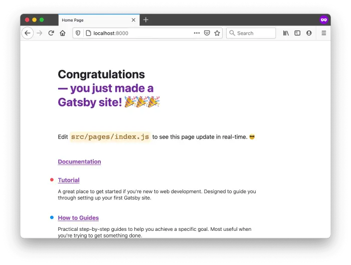
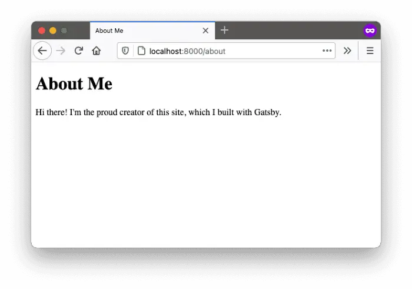
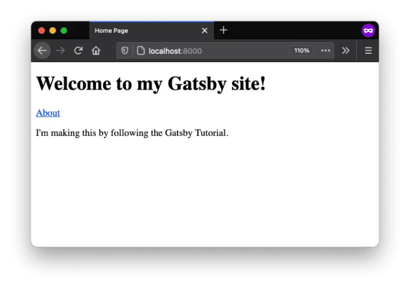
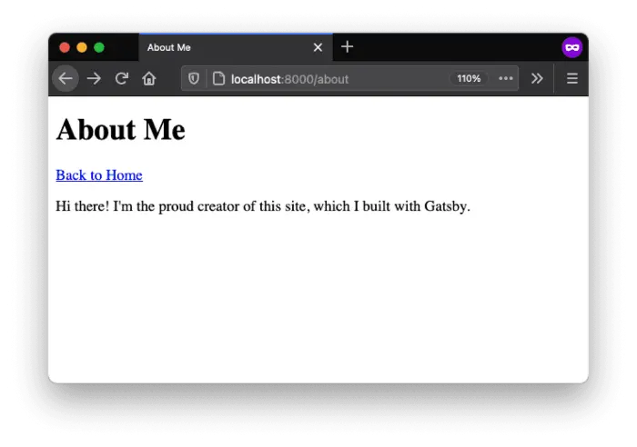
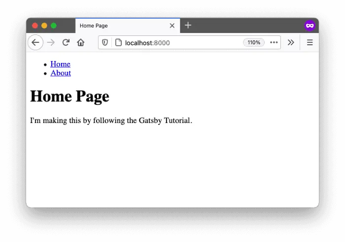
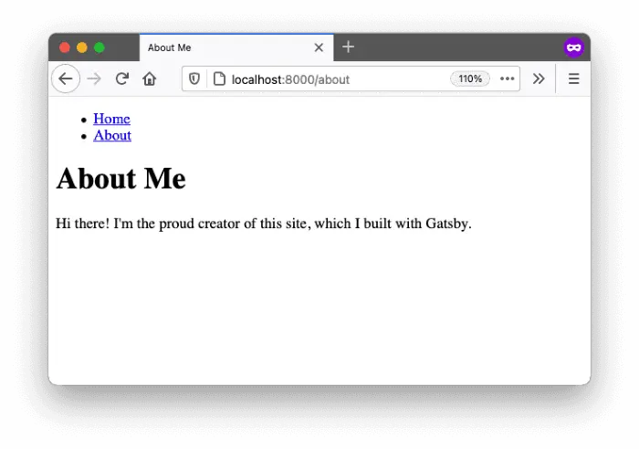
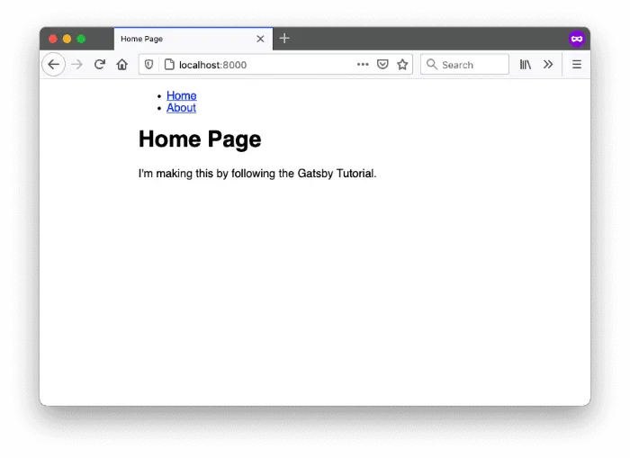
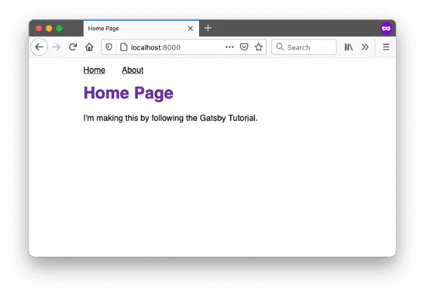

# Lecture 4
{:.no_toc}

* 
{:toc}


## Frameworks

* In the previous lectures, we've seen the evolution of the web technologies, from native HTML to CSS and JavaScript to Node.js, TypeScript, and React. But the evolution is still going on, and new technologies are being developed every day.

* Besides React, there are many other popular frameworks, such as [Angular](https://angular.dev/), [Vue.js](https://vuejs.org/), and [Svelte](https://svelte.dev/).
 
* Based on React, there are also many topper frameworks, such as [Next.js](https://nextjs.org/), [Gatsby](https://www.gatsbyjs.com/). Gatsby is specialized in static site generation, which means it will compile the whole project locally into native HTML, CSS, and JavaScript files, and then deploy (upload) them to a server. This is the reason why we choose Gatsby for this course. It just fits the needs of building a iGEM wiki website.

## Getting Started with Gatsby

* The Gatsby command line interface (CLI) is a tool that lets us quickly create new Gatsby-powered sites and run commands for developing Gatsby sites, we can install it using npm.
  ```bash
  pnpm install -g gatsby-cli
  ```

* To create a new Gatsby site, we can run the following command:
  ```bash
  gatsby new
  ```
  We will choose Sass, Typescript as the initial options.

* After `gatsby-cli` has finished creating the project, we can navigate to the project folder and run the following command to switch to `pnpm`:
  ```bash
  cd gatsby-iweb
  rm -rf node_modules package-lock.json
  pnpm install
  pnpm upgrade
  ```

* To start the development server, we can run the following command:
  ```bash
  gatsby develop
  ```
  The development server will start at `http://localhost:8000/`. We can open this URL in a web browser to see the site:
  


## Structure of a Gatsby Project

* A Gatsby project has a similar structure to a React project, but with some additional files and folders. The following is the structure of a Gatsby project:
  ```bash
  .
  ├── .cache
  ├── .gitignore
  ├── README.md
  ├── gatsby-config.ts
  ├── node_modules
  │   ├── @babel
  │   ├── @types
  │   ├── @typescript-eslint
  |   ...
  │   └── gatsby
  ├── package.json
  ├── pnpm-lock.yaml
  ├── public
  │   ├── page-data
  │   ├── static
  │   └── ~partytown
  ├── src
  │   ├── images
  │   │   └── icon.png
  │   └── pages
  │       ├── 404.tsx
  │       └── index.tsx
  └── tsconfig.json
  ```

  * The `README.md` file is a markdown file that contains the documentation of the project.
  * The `gatsby-config.ts` file is a TypeScript file that contains the configuration of the Gatsby project, such as the site metadata, plugins, and other settings.
  * The `src/pages` folder contains the pages of the site. Each file in this folder represents a page of the site.
    * For example, the `src/pages/hello.tsx` file represents the home page (`localhost:8000/hello`) of the site.
  * The `public` folder contains the compiled files of the site, such as the HTML, CSS, and JavaScript files.
  * The `package.json` file contains the dependencies and scripts of the project.
  * The `tsconfig.json` file contains the TypeScript configuration of the project.

## Creating a Page

* Let's create a new page called `about.tsx` in the `src/pages` folder. The content of the page will be as follows:
  > It's crucial to export a default component, which will be used Gatsby to render the page.

  ```tsx
  import * as React from 'react'

  const AboutPage: React.FC = () => (
    <main>
      <h1>About Me</h1>
      <p>Hi there! I'm the proud creator of this site, which I built with Gatsby.</p>
    </main>
  );

  export default AboutPage;
  ```

* Gatsby lets us define a `<title>` and other [document metadata](https://developer.mozilla.org/en-US/docs/Web/HTML/Element/head) with the [Gatsby Head API](https://www.gatsbyjs.com/docs/reference/built-in-components/gatsby-head/). We have to export a component called Head from our page template to apply the metadata. Adding such metadata helps search engines like Google to better understand our site.
  > Don't forget to export the `Head` component so the external system can use it.

  ```tsx
  import * as React from 'react'

  const AboutPage: React.FC = () => (
    <main>
      <h1>About Me</h1>
      <p>Hi there! I'm the proud creator of this site, which I built with Gatsby.</p>
    </main>
  );

  export const Head = () => (
    <>
      <title>About Me</title>
      <meta name="description" content="Your description" />
    </>
  )
  export default AboutPage;
  ```

* Now we should be able to view the new page at `http://localhost:8000/about`:
  

* Gatsby will "listen" to all local changes and automatically update the page in the browser. This is called hot reloading.


## Linking the Pages

* Now we've built a new page, it's common that we add new link in the home page to navigate to the new page. 
* Let's clear the template content in the `index.tsx` and add a link to the new page:
  ```tsx
  import * as React from 'react'

  const IndexPage: React.FC = () => {
    return (
      <main>
        <h1>Welcome to my Gatsby site!</h1>
        <a href="/about">About</a>
        <p>I'm making this by following the Gatsby Tutorial.</p>
      </main>
    )
  }

  export const Head = () => <title>Home Page</title>

  export default IndexPage

  ```
  

* Gatsby actually provides a `<Link />` component for us, which is better than using the `<a>` tag. 
  ```tsx
  import * as React from 'react'
  import { Link } from 'gatsby'

  const IndexPage: React.FC = () => {
    return (
      <main>
        <h1>Welcome to my Gatsby site!</h1>
        <Link to="/about">About</Link>
        <p>I'm making this by following the Gatsby Tutorial.</p>
      </main>
    )
  }

  export const Head = () => <title>Home Page</title>

  export default IndexPage
  ```

* The `<Link />` comes with many benefits:
  * It's faster than the `<a>` tag because it doesn't reload the whole page, only update the changed part of the webpage.
  * It preload the linked page when user hover the link, which makes a slight faster performance.
  * We could config a global prefix in `gatsby-config.ts`, which only applies to the `<Link />` component, a bare `<a>` tag will not be affected.

* Let's also add a link in about page to go back home page.
  ```tsx
  import * as React from 'react'
  import { Link } from 'gatsby'

  const AboutPage: React.FC = () => (
    <main>
      <h1>About Me</h1>
      <p>Hi there! I'm the proud creator of this site, which I built with Gatsby.</p>
      <Link to="/">Back to Home</Link>
    </main>
  );

  export const Head = () => (
    <>
      <title>About Me</title>
      <meta name="description" content="Your description" />
    </>
  )
  export default AboutPage;
  ```
  


## Create a Shared Layout

* When more and more pages being added, it's common that we want to share the same layout across all pages. 
* Let's use React's children prop feature to create a shared layout component.
* Create a new file called `layout.tsx` in the `src/components` folder:
  ```tsx
  import * as React from 'react'
  import { Link } from 'gatsby'

  const Layout: React.FC = ({ children }) => (
    <div>
      <header>
        <nav>
          <ul>
            <li><Link to="/">Home</Link></li>
            <li><Link to="/about">About</Link></li>
          </ul>
        </nav>
      </header>
      <main>{children}</main>
    </div>
  )

  export default Layout
  ```

* Update the `index.tsx` and `about.tsx` to use the `Layout` component:
  ```tsx
  import * as React from 'react'
  import Layout from '../components/layout'

  const IndexPage: React.FC = () => {
    return (
      <Layout>
        <h1>Welcome to my Gatsby site!</h1>
        <p>I'm making this by following the Gatsby Tutorial.</p>
      </Layout>
    )
  }

  export const Head = () => <title>Home Page</title>

  export default IndexPage
  ```
  


  ```tsx
  import * as React from 'react'
  import Layout from '../components/layout'
  import { Link } from 'gatsby'

  const AboutPage: React.FC = () => (
    <Layout>
      <h1>About Me</h1>
      <p>Hi there! I'm the proud creator of this site, which I built with Gatsby.</p>
      <Link to="/">Back to Home</Link>
    </Layout>
  );

  export const Head = () => (
    <>
      <title>About Me</title>
      <meta name="description" content="Your description" />
    </>
  )
  export default AboutPage;
  ```
  

* Let's further add props to the `Layout` component to pass in the title of the page:
  ```tsx
  import * as React from 'react'
  import { Link } from 'gatsby'

  interface LayoutProps {
    title: string;  
    children: React.ReactNode;
  }

  const Layout: React.FC<LayoutProps> = ({ title, children }) => (
    <div>
      <header>
        <nav>
          <ul>
            <li><Link to="/">Home</Link></li>
            <li><Link to="/about">About</Link></li>
          </ul>
        </nav>
      </header>
      <main>
        <h1>{title}</h1>
        {children}
      </main>
    </div>
  )


  export default Layout
  ```

* Update the `index.tsx` and `about.tsx` to pass in the title of the page:
  ```tsx
  import * as React from 'react'
  import Layout from '../components/layout'

  const IndexPage: React.FC = () => {
    return (
      <Layout title="Home Page">
        <p>I'm making this by following the Gatsby Tutorial.</p>
      </Layout>
    )
  }

  export const Head = () => <title>Home Page</title>

  export default IndexPage
  ```

  ```tsx
  import * as React from 'react'
  import Layout from '../components/layout'

  const AboutPage: React.FC = () => (
    <Layout title="About Me">
      <p>Hi there! I'm the proud creator of this site, which I built with Gatsby.</p>
    </Layout>
  );

  export const Head = () => (
    <>
      <title>About Me</title>
      <meta name="description" content="Your description" />
    </>
  )

  export default AboutPage;
  ```

## Style with Sass using Gatsby Plugin

* We init our Gatsby template only with TypeScript, to add Sass support, we need to install the Gatsby plugin for Sass.
* Plugins is the major feature of Gatsby, which allows us to extend the functionality of Gatsby in a modular way.
* To install the Gatsby plugin for Sass, we first stop the local server by pressing `Ctrl + C` in the terminal, and then run the following command: 
  ```bash
  pnpm install gatsby-plugin-sass
  ```
* After the installation is complete, we need to add the plugin to the `gatsby-config.ts` file:
  ```ts
    plugins: [
    `gatsby-plugin-sass`,
  ],
  ```
* Add a module type declare for TypeScript `src/types/styles.d.ts`:
  ```ts
  declare module '*.scss' {
    const content: { [className: string]: string };
    export default content;
  }
  ``` 
* Write our first Sass file `src/styles/modules/layout.module.css`:
  ```scss
  main {
    .container {
      margin: auto;
      max-width: 500px;
      font-family: sans-serif;
    }
  }
  ```
* Import the Sass file in the `layout.tsx`:
  ```tsx
  import * as React from 'react'
  import { Link } from 'gatsby'
  import styles from '../styles/modules/layout.module.scss'

  interface LayoutProps {
    title: string;  
    children: React.ReactNode;
  }

  const Layout: React.FC<LayoutProps> = ({ title, children }) => (
    <div className={styles.container}>
      <header>
        <nav>
          <ul>
            <li><Link to="/">Home</Link></li>
            <li><Link to="/about">About</Link></li>
          </ul>
        </nav>
      </header>
      <main>
        <h1>{title}</h1>
        {children}
      </main>
    </div>
  )

  export default Layout
  ```
  

* Let's add more styles:
  ```scss
  main {
    .container {
      margin: auto;
      max-width: 500px;
      font-family: sans-serif;
    }

    h1 {
      color: rebeccapurple;
    }

    nav {    
      ul {
        display: flex;
        list-style: none;
        padding-left: 0;
      }

      li {
        padding-right: 2rem;
      }

      a {
        color: black;
      }
    }
  }
  ```
  


