# Lecture 5
{:.no_toc}

* 
{:toc}


## Version Control

* Imagine you've implemented a new feature in your project, but you don't ensure will it breaks the existing code or not. Without version control, we might have to manually keep ton's of copies of the same project.

* Imagine you are working on a group project. Each member is responsible for a different part of the project. Without version control, it would be challenging to keep track of who made what changes and when. 

## Git

* Git is a distributed version control system that tracks changes in any set of files, usually used for coordinating work among programmers collaboratively developing source code during software development.

  ```mermaid
  graph LR
    A[first commit] --> B[changes]
    B --> C[more changes]
    C --> D[start new feature]
    D --> E[keep working on new feature]
  ```

* Specifically, Git tracks creating or removal of files, and the adding or removing of lines of text (code) within those files. 

  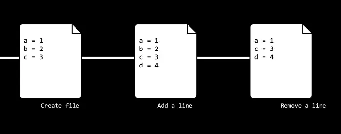

* Distributed means each member will keep a full copy of the project, and only sync the changes through the network.

  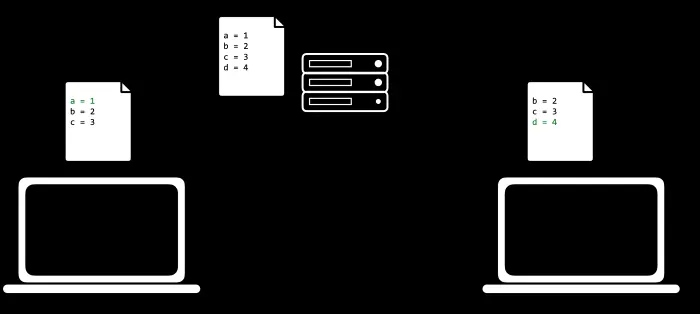

* Install it through:
  ```bash
  sudo apt install git
  ```

## VSCode's Integration with Git

* Visual Studio Code (VSCode) has built-in Git support, making it easier to manage your repositories.
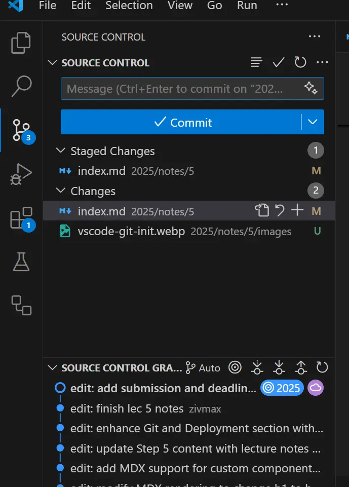

### Features

* **Add and Commit**: You can stage changes and commit them directly from the Source Control view.

  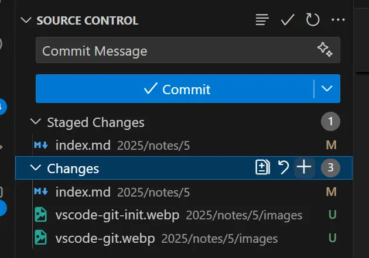

* **Branching**: Easily create and switch branches using the Git: Create Branch and Git: Checkout to commands.

  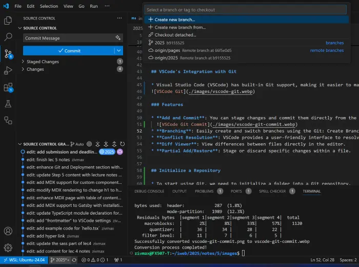

* **Conflict Resolution**: VSCode provides a user-friendly interface to resolve merge conflicts.

  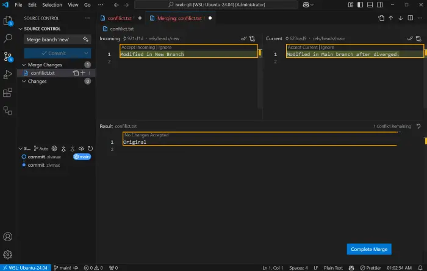

* **Diff Viewer**: View differences between files directly in the editor.

  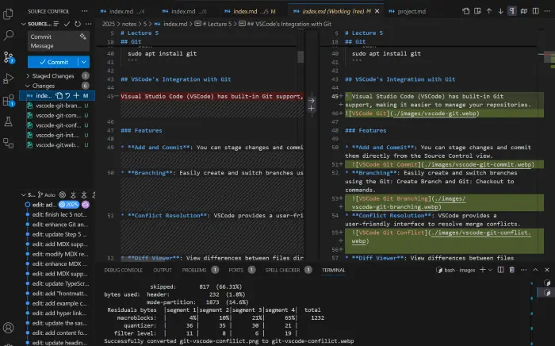

* **Partial Add/Restore**: Stage or discard specific changes within a file.

  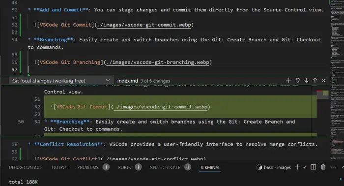


## Initialize a Repository

* To start using Git, we need to initialize a folder into a Git repository.

  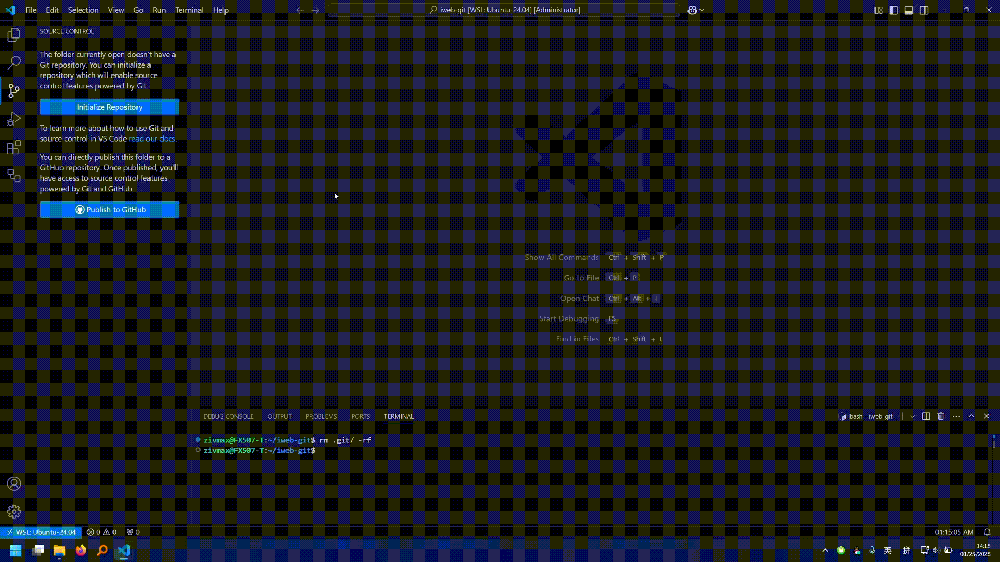

## Stage Changes and Commit

* Before committing changes, we need to stage them. Staging allows us to group related changes together, leaving unrelated changes out of the commit.

* Unstaged changes could be dropped easily.
  
* To commit, we first specify which changes (stage changes) needs to be committed, and we **must** leave a commit message explaining what have we done in this commit. The commit message are natural to be compulsory, without it, we can't distinguish between different commits.

* Each commit creates a version we could revert back. 

  ```mermaid
  gitGraph
      commit id: "first commit"
      commit id: "changes"
      commit id: "more changes"
  ```

* Demo:
  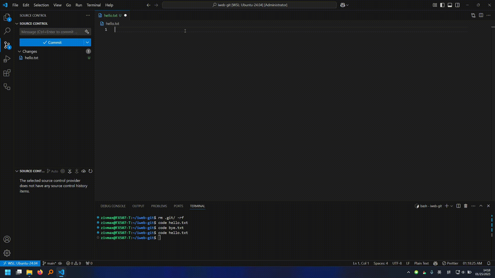

## Branching

* Branching is basically keep multiple track of the project. Each branch is a separate line of development, and each branch can have its own commits.

  ```mermaid
  gitGraph
      commit id: "first commit"
      commit id: "changes"
      commit id: "more changes"
      branch fix-branch
      checkout fix-branch
      commit id: "fix bug"
      checkout main
      branch feat-branch
      checkout feat-branch
      commit id: "start new feature"
      commit id: "keep working on new feature"
  ```

* Branching allows us to add a new feature, while ensuring there's stable and workable version of the project being accessible.

* Also branching is helpful when there are multiple developers working on the same project. Each developer can work on a separate branch for a consistent experience.

* Demo:
  
  
## Merge

* Merging is the process of combining changes from different branches into a single branch.

  ```mermaid
  gitGraph
      commit id: "first commit"
      commit id: "changes"
      commit id: "more changes"
      branch fix-branch
      checkout fix-branch
      commit id: "fix bug"
      checkout main
      branch feat-branch
      checkout feat-branch
      commit id: "start new feature"
      commit id: "keep working on new feature"
      checkout main
      merge fix-branch
  ```
* Demo:
  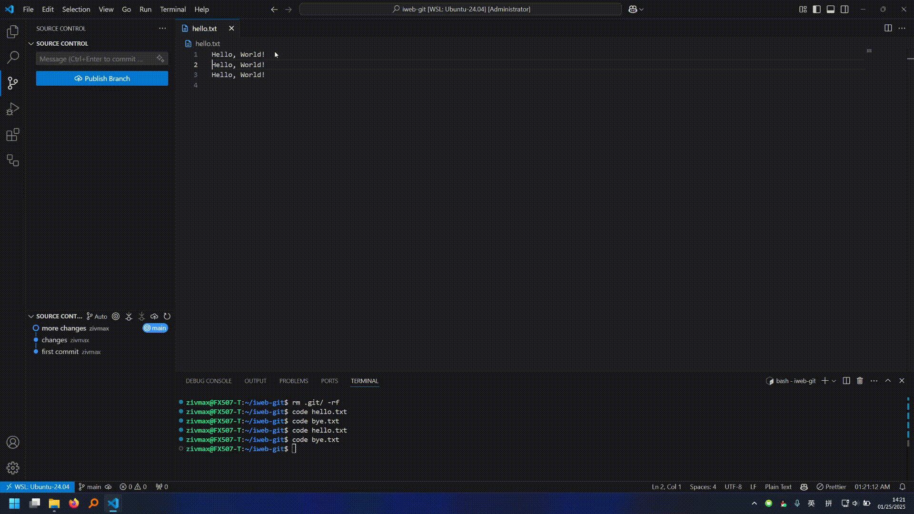
  
## Conflicts

* Conflicts occur when Git is unable to automatically merge changes. 

* This usually happens when two branches have made changes to the same part of the same file.
  1. Assuming this line of code:
    ```tsx
    // Main
    const a = 1;
    ```

  2. It diverges into a new branch, and the code becomes:
    ```tsx
    // New
    const a = 2;
    ```

  3. After the branch is diverged, the main branch changes the code without (and can't) telling the new branch:
    ```tsx
    // Main
    const a = 3;
    ```

  4. When merging the new branch back to the main branch, Git will have a conflict:
    ```tsx
    // Main Merging New
    <<<<< HEAD
    const a = 3;
    =====
    >>>>> New
    ```

* Resolving conflicts involves manually editing the conflicting files to resolve the differences.
  1. Continuing the example above, we could resolve the conflict by manually changing the code to:
    ```tsx
    // Main Merging New
    const a = 2;
    ```
  2. Then we stage and commit the changes to finish the merge.

  * Demo:
    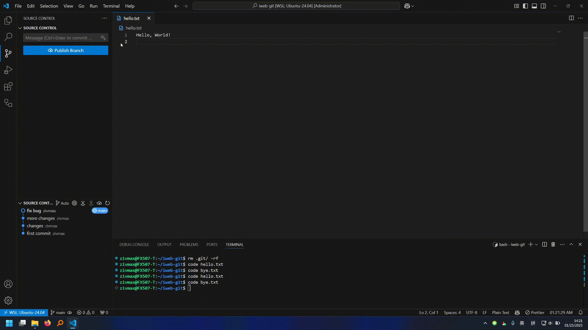
  
* Utilizing the VSCode's built-in conflict resolution tool can help simplify the process.
  * Demo:
    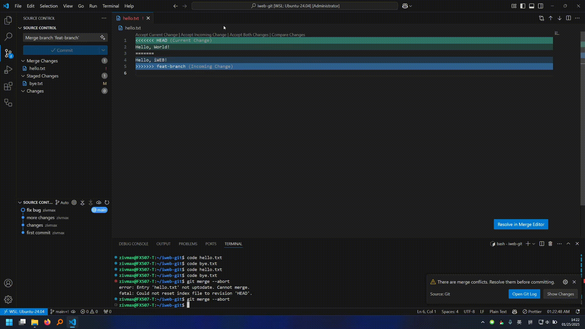


## GitLab

* For solo project, we might want a cloud server to store our project. Or even publish the project as a open-source project.

* For group project, we might want a cloud server where every member could access to sync the changes.

* There are companies providing such service for free, like [GitHub](https://github.com/), [GitLab](https://about.gitlab.com/), [Bitbucket](https://bitbucket.org/product/), etc.

* We will pick up GitLab as iGEM uses a community version of GitLab.

## Create a Project on GitLab

* To create a project on GitLab, you need to have an account. If you don't have one, you can create one for free.

* After logging in, you can create a new project by clicking on the **New Project** button.
  

* Let's create a new project named `gatsby-iweb` on GitLab.
  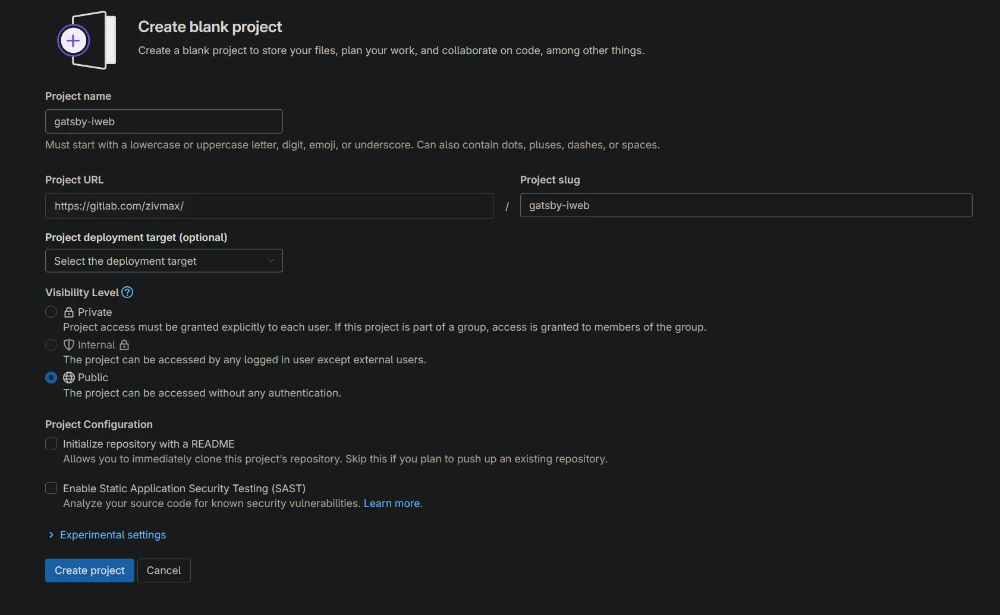


* To upload (push) our project to GitLab, we need to add a remote repository to our local repository.
  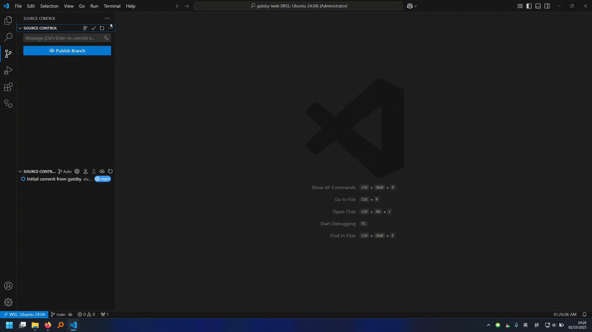


* The remote repository URL can be found on the project's page on GitLab.

* After adding the remote repository, we can upload (push) our project to GitLab:
  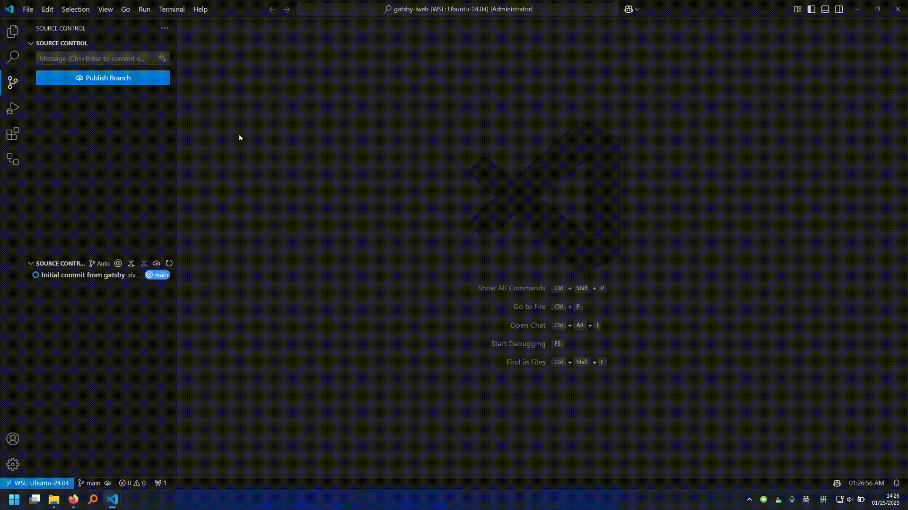

* Now we could view the project on GitLab:
  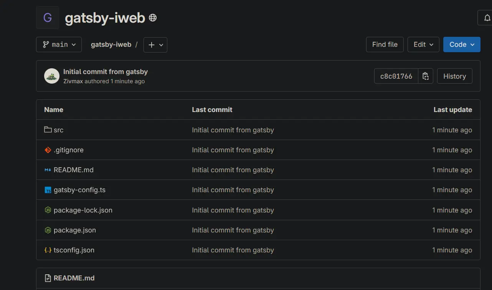

## Deployment

* Deployment is the process of making your website live and accessible to the public.

* As we mentioned in the previous lecture, for a static website, the key is to put our files on a server running a http server.

* Gatsby keeps the compiled files in the `public` directory, so we just need to manage to put those files on a server.

* We can try a local deployment first:
  * Open a terminal and navigate to the project directory.
  * Run the following command to start a local server:
    ```bash
    python -m http.server -d public
    ```

## GitLab Pages

* [GitLab Pages](https://docs.gitlab.com/ee/user/project/pages/) allows us to host static websites directly on GitLab.

* To deploy a Gatsby site to GitLab Pages, we need to create a `.gitlab-ci.yml` file in the root of our project.

* The `.gitlab-ci.yml` file basically is a terminal script telling GitLab to run which commands to deploy the project.
   ```yaml
  image: node:lts-slim

  stages:
    - deploy

  pages:
    stage: deploy
    script:
      - corepack enable
      - corepack prepare pnpm@latest-9 --activate
      - pnpm install --frozen-lockfile --prod
      - pnpm run build --prefix-paths
    artifacts:
      paths:
        - public
    only:
      - main
   ```

  * `image`: The OS image to use for the build.
  * `stages`: The stages of the pipeline.
  * `pages`: The job to deploy the site.
  * `script`: The commands to run to deploy the site.
  * `artifacts`: The files to be deployed.
  * `only`: The branch which triggers the deployment when pushed.
  


## URL Prefix

* Once we deployed the website, we'll quickly notice that something is wrong. The website is not working as expected.

* This is because Gatsby assumes the website is hosted at the root of the domain, recall that when we run the deployment locally, we use the root of the domain `http://localhost:8000/`. But now the deployment is at `https://<user-name>.gitlab.io/gatsby-iweb/`.

* This will cause all the internal links and files' path to be wrong. For example, the path to the `about` page will be `/about`, but the correct path should be `/gatsby-iweb/about`.

* This is what's URL prefix for. We can set a URL prefix in Gatsby to tell Gatsby that the website is hosted at a subdirectory.
   ```ts
   // gatsby-config.ts
   const config: GatsbyConfig = {
     pathPrefix: "/gatsby-iweb",
   }
   ```

* Now, the rebuilt website should works fine.

## Robust Deployment Strategy for iGEM's GitLab

* iGEM actually uses a community version of GitLab hosted on their own server.

* But their server has a poor performance, so the build time will be very long.

* Even worse, a 10 mins build time limit is set, so if the build time exceeds 10 mins, the build will be terminated.

* To prevent this, a better and more robust deployment strategy is we build the website locally, and only push the compiled files to GitLab. Then in the `.gitlab-ci.yml`, we only need to download the compiled files from the branch and deploy them directly.
  ```yaml
  image: alpine:latest

  variables:
    DEPLOY_BRANCH: "pages"  # The branch name is fixed as 'pages'

  stages:
    - deploy

  pages:
    stage: deploy
    script:
      - apk update && apk add curl bash
      - echo "Downloading ZIP file..."
      - curl -L -o ${CI_PROJECT_NAME}-${DEPLOY_BRANCH}.zip "https://gitlab.com/${CI_PROJECT_NAMESPACE}/${CI_PROJECT_NAME}/-/archive/${DEPLOY_BRANCH}/${CI_PROJECT_NAME}-${DEPLOY_BRANCH}.zip"
      - unzip ${CI_PROJECT_NAME}-${DEPLOY_BRANCH}.zip
      - rm ${CI_PROJECT_NAME}-${DEPLOY_BRANCH}.zip
      - mkdir public/
      - mv ${CI_PROJECT_NAME}-${DEPLOY_BRANCH}/* public/
    artifacts:
      paths:
        - public
    only:
      - main
    ```

* For automatic build and push, we could use the `gh-page` package to deploy the website to the `pages` branch.
  * First, install the package:
    ```bash
    pnpm install gh-pages --save-dev
    ```  
  
  * Then, add the following scripts to the `package.json`:
    ```json
    "scripts": {
      "deploy": "gatsby build --prefix-paths && gh-pages -d public -b pages -f"
    }
    ```

## Deploy a Compressed Website

* The modern browsers support to automatically decompress the compressed website, so we could compress the website to reduce the size of the website. So user could use less network traffic to load the website.

* Let's use the `brotli` to compress the website:
  ```yaml
  image: alpine:latest

  variables:
    DEPLOY_BRANCH: "pages"  # The branch name is fixed as 'pages'

  stages:
    - deploy

  pages:
    stage: deploy
    script:
      - apk update && apk add zip curl brotli bash
      - echo "Downloading ZIP file..."
      - curl -L -o ${CI_PROJECT_NAME}-${DEPLOY_BRANCH}.zip "https://gitlab.igem.org/${CI_PROJECT_NAMESPACE}/${CI_PROJECT_NAME}/-/archive/${DEPLOY_BRANCH}/${CI_PROJECT_NAME}-${DEPLOY_BRANCH}.zip"
      - unzip ${CI_PROJECT_NAME}-${DEPLOY_BRANCH}.zip
      - rm ${CI_PROJECT_NAME}-${DEPLOY_BRANCH}.zip
      - mkdir public/
      - mv ${CI_PROJECT_NAME}-${DEPLOY_BRANCH}/* public/
      - find public -type f -regex '.*\.\(htm\|html\|txt\|text\|js\|css\)' -exec brotli -f -k {} \;
    artifacts:
      paths:
        - public
    only:
      - main
  ```

* Through the developer tools in the browser, we could see the website is transferred in a compressed format, and the transfer size is reduced.

## What's Next?

* Throughout this course, we've embarked on an exciting journey into web programming, specifically tailored for building an iGEM wiki website. We've explored the history, explored essential technologies, and familiarized ourselves with the tools that make modern web development possible.

* We began with the fundamentals of Computer Networks, laying the groundwork for understanding how the Internet operates, particularly through the HTTP protocol. From there, we dived into the core technologies of the web: HTML, CSS, and JavaScript, which form the backbone of any website.

* As we progressed, we quickly transitioned to modern web development tools and frameworks, which are Node.js, TypeScript, and React. These technologies have revolutionized the way we build web applications, offering greater flexibility, scalability, and efficiency.

* We then introduced Gatsby, a powerful static site generator built on React. Gatsby enables us to create highly optimized, static websites with ease, making it an ideal choice for developing an iGEM wiki. 

* To ensure our work is well-organized and collaborative, we explored Git, a version control system that allows us to track changes, collaborate seamlessly, and maintain a history of our project. We also walked through the process of deploying our website using services like GitLab Pages, ensuring our wiki is accessible to the world. Additionally, we covered some handy tips and tricks to specifically meet iGEM's wiki deployment requirements.

* So far, you should feel fully empowered to build your team's wiki website, not just in a functional way, but in a modern, efficient, and professional manner. 

* As you move forward, remember that web development is a constantly evolving field. Stay curious, keep experimenting, and don't hesitate to explore new tools and techniques. The skills you've gained here are just the beginning of what you can achieve.

* Thank you for joining this journey, and best of luck as you build your iGEM wiki and beyond!
